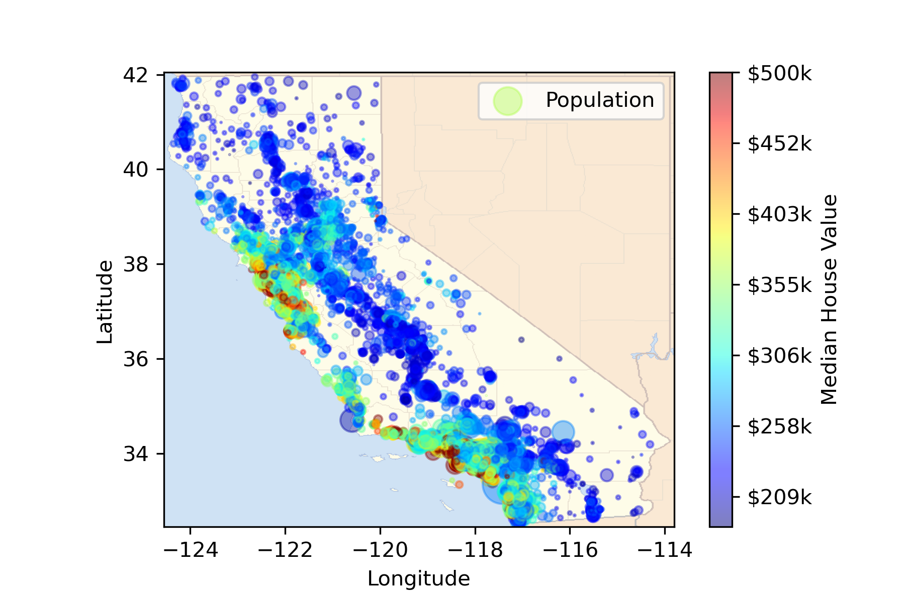

<p>

</p>


# California Housing Prices Prediction

**Authors**: Ning Chen

The task is to use California census data to build a model of housing prices in the state. This data includes metrics such as the population, median income, and median housing price for each block group in California. Block groups are the smallest geographical unit for which the US Census Bureau publishes sample data. The model will learn from this data and be able to predict the median housing price in any district, given all the other metrics.

## Business Understanding

The model’s output (a prediction of a district’s median housing price) will be fed to another Machine Learning system, along with many other signals. This downstream system will determine whether it is worth investing in a given area or not. Getting this right is critical, as it directly affects revenue.

## Data Understanding


### Exploratory Data Analysis (EDA)


### Heatmap





## Data Preparation

### Data Cleaning & Feature Engineering
The rows with extreme values is considered. Identify categorical variables in the data set and create dummy columns to numeric format through one-hot encoding. New features are generated.


## Modeling

### Data Split and Normalization
Data is split to training and testing data, and then standardized with respect to normal distribution.

### Linear Regression, SVR(Support Vector Regression) and Random Forest Regression

Fit the model to the training data. Use the model to predict on the training set and the test set. Evaluate the training and test predictions using RMSE. Determine if the model is overfit.

### Fine-tune the model with Grid Search and Randomized Search


## For More Information

Please review the full analysis in [our Jupyter Notebook](https://github.com/ghcn345/California-Housing-Prices-Prediction/blob/master/Housing_Prices_Prediction.ipynb).

For any additional questions, please contact **Ning Chen—chen.ning345@gmail.com**

## Repository Structure

Description of the structure of the repository and its contents:

```
├── README.md                                     <- The top-level README for reviewers of this project
├── Housing_Prices_Prediction                     <- Narrative documentation for prediction in Jupyter notebook
├── my_model                                      <- Saved trained model
├── data                                          <- California Housing data
└── images                                        <- Both sourced externally and generated from code

```
